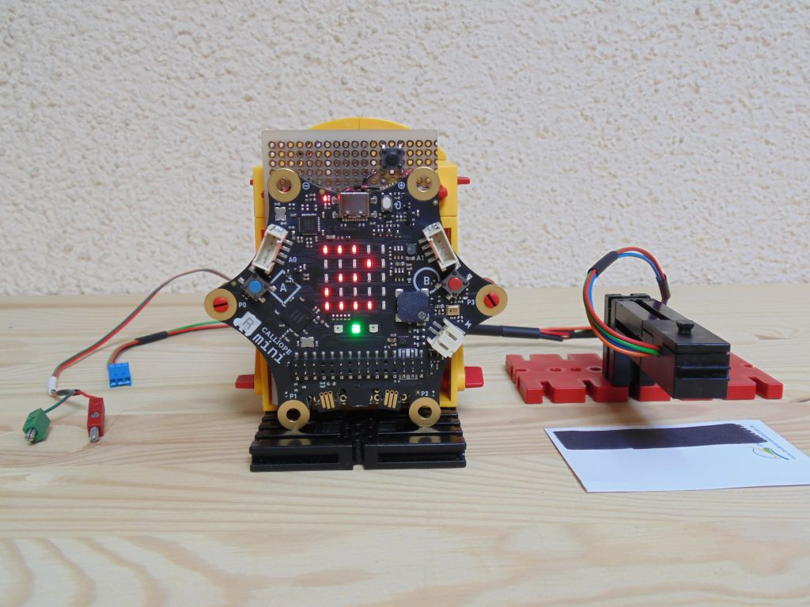

> Diese Seite bei [https://calliope-net.github.io/controller-63/](https://calliope-net.github.io/controller-63/) öffnen

## Als Erweiterung verwenden

Dieses Repository kann als **Erweiterung** in MakeCode hinzugefügt werden.

* öffne [https://makecode.calliope.cc/](https://makecode.calliope.cc/)
* klicke auf **Neues Projekt**
* klicke auf **Erweiterungen** unter dem Zahnrad-Menü
* nach **https://github.com/calliope-net/controller-63** suchen und importieren

## Dieses Projekt bearbeiten

Um dieses Repository in MakeCode zu bearbeiten.

* öffne [https://makecode.calliope.cc/](https://makecode.calliope.cc/)
* klicke auf **Importieren** und dann auf **Importiere URL**
* füge **https://github.com/calliope-net/controller-63** ein und klicke auf Importieren

#### Metadaten (verwendet für Suche, Rendering)

* for PXT/calliopemini

